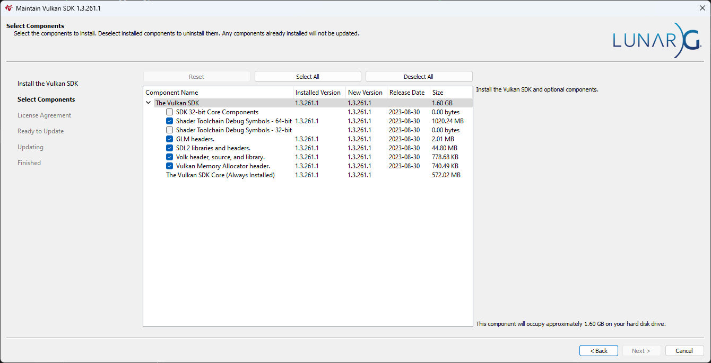
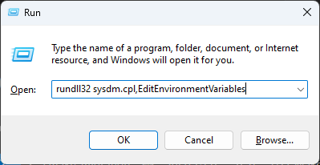
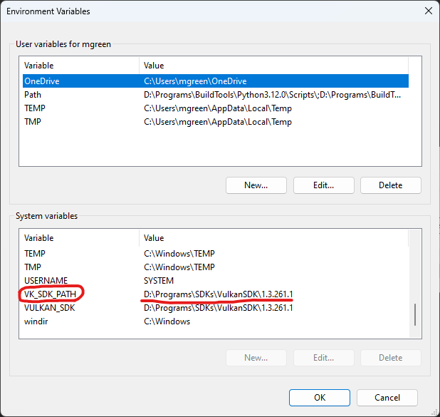
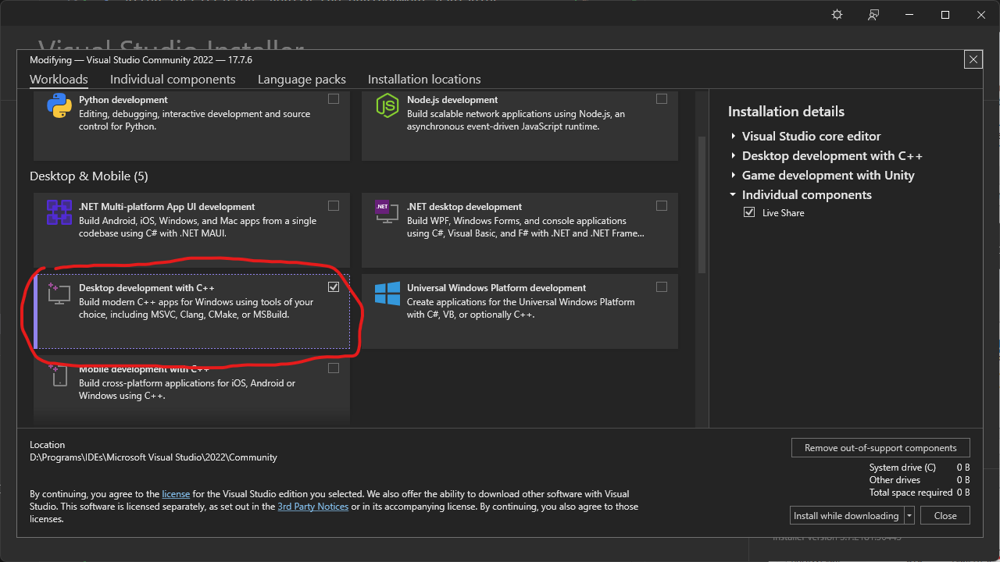
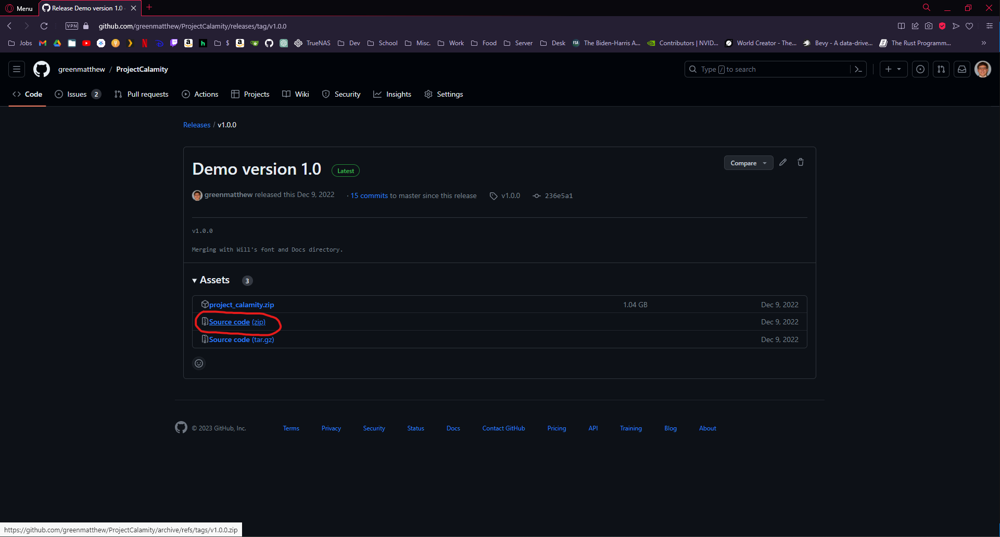

# HarvestHavoc

## How to Build

> ***\*\*Requirements: Windows 10 or 11\*\****

### 1. Install Vulkan SDK
1. Download [Vulkan SDK v1.3.261.1](https://sdk.lunarg.com/sdk/download/1.3.261.1/windows/VulkanSDK-1.3.261.1-Installer.exe). This is the version used during the development of the project. However, newer versions of the Vulkan SDK are likely to be compatible.

2. Run the installer and select the following components:
   - Shader Toolchain Debug Symbols - 64-bit
   - DLM headers
   - SDL2 libraries and headers
   - Volk header, source, and library
   - Vulkan Memory Allocator header

   

3. After installation, verify the environment variables:
   - Open the Environment Variables window (Press `Win + R`, enter `rundll32 sysdm.cpl,EditEnvironmentVariables`, and hit `Enter`).

     

   - Ensure the `VULKAN_SDK` variable is set correctly under 'System variables'.

     

### 2. Installing CMake on Windows

#### 1. Download CMake for Windows:

1. Visit the [CMake downloads page](https://cmake.org/download/).
2. Download the latest stable release suitable for Windows. CMake provides both installer and ZIP versions. The installer version is generally more convenient.

#### 2. Run the Installer (if you downloaded the installer version):
1. Execute the downloaded installer file.
2. Agree to the license terms.
3. Choose whether to install CMake for all users (requires administrative privileges) or just for the current user.

#### 3. Select Installation Options:

1. During the installation, you'll be prompted to select additional options. One important option is whether to add CMake to the system PATH.
2. Adding CMake to the PATH is highly recommended as it allows you to run CMake from any command line or terminal window, which is convenient.

#### 4. Complete the Installation:

- Proceed with the installation. The installer will set up CMake on your system.

#### 5. Verify Installation:

1. After installation, open a command prompt or terminal window.
2. Type ```cmake --version``` and press Enter. This command should return the installed version of CMake, confirming that it is correctly installed and accessible from the command line.

#### Additional Considerations
- Administrator Rights: If you choose to install CMake for all users, you will need administrator rights on your computer.
- ZIP Version: If you download the ZIP version instead of the installer, you will need to manually extract the files and add the CMake binary directory to your system's PATH variable.

### 3. Installing Visual Studio 2022

#### 1. Download Visual Studio 2022 Installer:

1. Visit the [Visual Studio downloads page](https://visualstudio.microsoft.com/downloads/).
2. Choose the edition of Visual Studio 2022 that you want (e.g., Community, Professional, or Enterprise).
3. Download the installer.

#### 2. Run the Installer:
- Execute the downloaded installer file on your machine.

#### 3. Select the Workload:

1. In the installer interface, look for the "Workloads" tab.
2. Under this tab, find and select the "Desktop development with C++" workload. This workload includes the C++ compiler, standard libraries, and other necessary tools needed to compile the project.



#### 4. Complete the Installation:

1. After selecting the necessary workloads and options, proceed with the installation.
2. The installer will download and install Visual Studio along with the selected components.

### 4. Obtain the Source Code

#### Option 1: Manually Downloading
1. Visit the [GitHub repository](https://github.com/greenmatthew/HarvestHavoc) or the my [personal Git website repository](https://git.matthewgreen.gg/mgreen/HarvestHavoc).
2. Navigate to the latest release and download the 'Source Code (zip)'.

   

3. Extract the .zip file to your preferred location.

#### Option 2: Using Git
1. If you're familiar with Git and have it installed, open PowerShell or your preferred terminal.
2. Clone the repository with submodules:

    > ***\*\* Ensure the URL is up-to-date.\*\****

    > ```git clone --recurse-submodules https://github.com/greenmatthew/HarvestHavoc.git```

    Or, if using my Git website:

    > ```git clone --recurse-submodules https://git.matthewgreen.gg/mgreen/HarvestHavoc.git```

3. Navigate to the repository directory and check out the specific commit hash of the latest release:
    >```cd HarvestHavoc```
4. Switch to the latest release commit:
    >```git checkout <HASH>```

### 5. Building the CMake Project
1. Create a Build Directory:
    > ```mkdir bin```

    This command creates a directory named bin where the build files will be placed.
2. Generate Build System Files:
    > ```cmake -G "Visual Studio 17 2022" -A x64 -B bin```
    
    This command tells CMake to generate build system files for Visual Studio 2019 (specifically for the x64 architecture) in the bin directory.

### 6. Running the Project
After generating the build system files, you have two main ways to build and run your project:

#### Using Visual Studio:

1. Open the generated Visual Studio Solution file (.sln) located in the bin directory using Visual Studio 2022.
2. Select the appropriate build configuration (like Debug or Release).
3. Build the project by using the Build menu or pressing Ctrl+Shift+B.
4. Run the project by pressing F5 to start debugging, or Ctrl+F5 to start without debugging.

#### Using CMake from the Command Line:

1. ##### Build the Project:

    Use the following command to build the project:

    > ```cmake --build bin --config Release```

    Here, bin is the directory where the build files are located, and Release is the build configuration. You can replace Release with another configuration like Debug depending on your needs.

2. Run the Executable:

    - For a Release build, use:
        > ```./bin/Release/HarvestHavoc.exe```
    - For a Debug build, use:
        > ```./bin/Debug/HarvestHavoc.exe```
